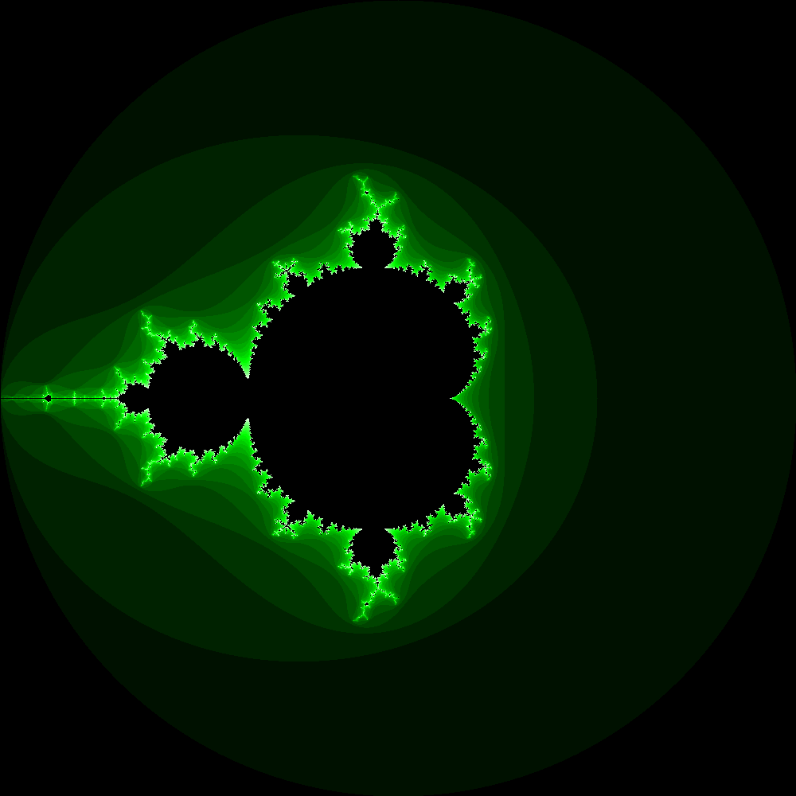
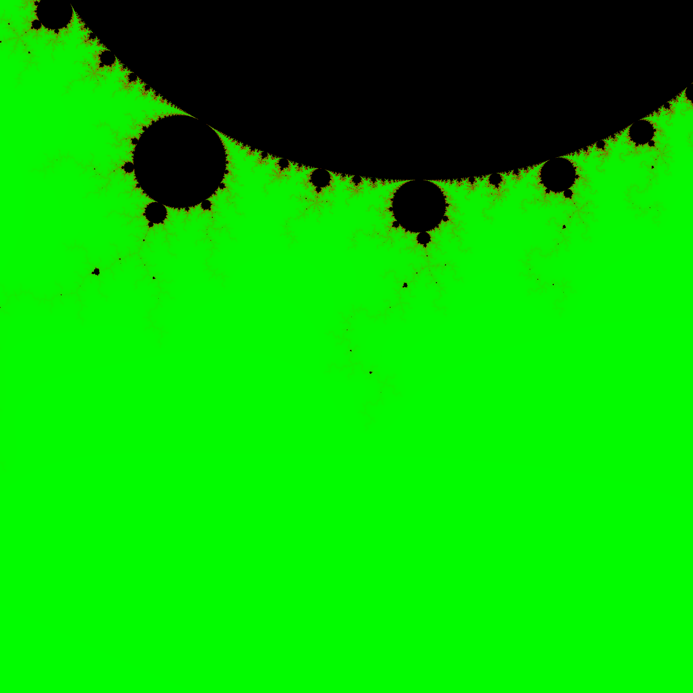

# Mandelbrot Set
A quick python implementation of a renderer for the Mandelbrot set.
## Get Started
Since python is..... well..... python -- you sadly have to install the dependencies first.
Use the following commands to install `numpy`, `pillow` and `numba`: 
`pip install numpy` 
`pip install pillow` 
`pip install numba` 
In order to generate an image open up the mbt.py file and edit the constants to your liking (set location, interations and zoom values). Once you're done with that you can simply execute `python mbt.py` in the root directory and see the image being generated (output file: `output.png`).

## Nice images we generated

